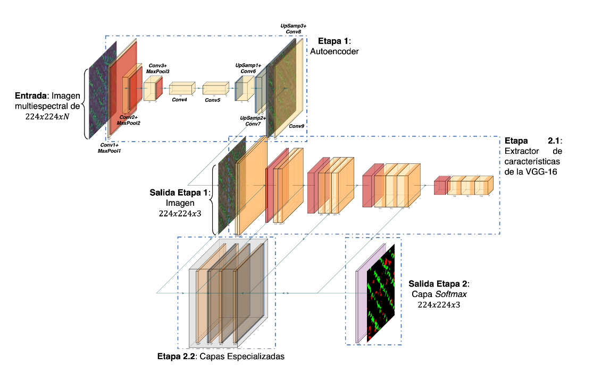

# Segmentación Semántica Multiclase Usando la Base de Datos [WeedMap](https://projects.asl.ethz.ch/datasets/doku.php?id=weedmap:remotesensing2018weedmap)

Los experimentos en este repositorio consisten en usar una arquitectura de dos etapas, la primera etapa consiste de un autoencoder que hace las veces de reductor de dimensionalidad teniendo como entrada/salida una imagen multiespectral. La salida, que sirve como entrada a la siguiente etapa, es una capa convolucional intermedia de tres (canales) que comprime la representación multiespectral. La siguiente etapa es la arquitectura DriuNet, esta arquitectura recibe una imagen RGB de entrada (nuestra representación de tres canales es un equivalente válido) y genera un mapa ortomosaico cuyos píxeles puede contener cada una las tres clases a inferir (maleza, cultivo y fondo).

Figura 1. Arquitectura Propuesta
